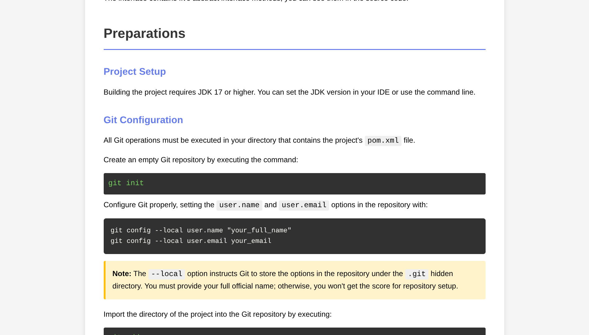

# SWE Midterm Test Simulation

This repository is a simulation of the SWE midterm test.

- Start the test from `EXAM.html`.
- Begin coding with the `countries` package.
- Import extra practice query interfaces from `src/main/java/exam/queries/`.
- Reference solutions in `src/main/java/exam/impl/`.

Requires JDK 25+.
